# DevopsProject--2
## Infrastructure Automation Platform Terraform | Ansible | AWS | Jenkins | Docker
This project demonstrates a complete Infrastructure as Code (IaC) and Configuration Management solution for provisioning and managing cloud infrastructure on Amazon Web Services (AWS).

The platform automates the complete infrastructure lifecycle using:
- **Terraform** for infrastructure provisioning
- **Ansible** for server configuration and application deployment
- **Jenkins** for Continuous Integration and Continuous Deployment (CI/CD)
- **Docker** for containerizing the application
- **NGINX** as a reverse proxy
- **AWS EC2** for hosting the application

The Jenkins pipeline includes a manual approval stage before infrastructure changes are applied, ensuring that every Terraform execution is reviewed before deployment.

As a demonstration, a lightweight Flask web application is containerized with Docker and deployed automatically onto the provisioned EC2 instance through Ansible.

## Features
- Infrastructure provisioning using Terraform
- Modular Terraform architecture
- Remote Terraform state stored in Amazon S3
- Terraform state locking using DynamoDB
- Dynamic Ansible inventory using AWS EC2 plugin
- Automated server configuration with Ansible roles
- Docker installation and application deployment
- NGINX reverse proxy configuration
- Jenkins CI/CD pipeline with manual approval
- Infrastructure validation after deployment
- Idempotent Ansible playbooks
- Easy environment teardown using Terraform Destroy


## Architecture
```
                           Jenkins Pipeline
                                  │
                                  ▼
                         Terraform Initialization
                                  │
                                  ▼
                            Terraform Plan
                                  │
                                  ▼
                         Manual Approval Gate
                                  │
                                  ▼
                           Terraform Apply
                                  │
                                  ▼
                     AWS Infrastructure Creation
              ┌─────────────────────────────────────┐
              │ VPC                                 │
              │ Public & Private Subnets            │
              │ Internet Gateway                    │
              │ NAT Gateway                         │
              │ Route Tables                        │
              │ Security Groups                     │
              │ IAM Roles                           │
              │ EC2 Instance(s)                     │
              └─────────────────────────────────────┘
                                  │
                                  ▼
                      Ansible Dynamic Inventory
                                  │
                                  ▼
                       Ansible Configuration
              ┌─────────────────────────────────────┐
              │ Docker Installation                 │
              │ Java Installation                   │
              │ Git Installation                    │
              │ Jenkins Agent Dependencies          │
              │ NGINX Configuration                 │
              │ Flask Application Deployment        │
              └─────────────────────────────────────┘
                                  │
                                  ▼
                    Infrastructure Validation Script
                                  │
                                  ▼
                  EC2 Reachability • HTTP 200 Response
                  Security Groups • Service Validation
```

## Repository Structure
```
.
├── app/
│   ├── app.py
│   ├── requirements.txt
│   └── Dockerfile
│
├── terraform/
│   ├── environments/
│   │   └── dev/
│   └── modules/
│       ├── networking/
│       ├── security/
│       ├── compute/
│       └── iam/
│
├── ansible/
│   ├── inventory/
│   ├── group_vars/
│   ├── roles/
│   │   ├── common/
│   │   ├── docker/
│   │   ├── java/
│   │   ├── git/
│   │   ├── nginx/
│   │   ├── jenkins_agent/
│   │   ├── k8s_prereqs/
│   │   └── app_deploy/
│   └── site.yml
│
├── jenkins/
│   └── Jenkinsfile
│
├── scripts/
│   └── validate_infra.sh
│
├── docs/
│   ├── architecture.md
│   └── runbook.md
│
└── README.md
```
## 🛠️ Tech Stack & Architecture

| Category | Technology | Purpose |
| :--- | :--- | :--- |
| **Cloud Provider** |  | Cloud Infrastructure |
| **Infrastructure as Code** |  | Provisioning & Infrastructure as Code |
| **Configuration** |  | Automated Configuration Management |
| **CI/CD** |  | Continuous Integration & Delivery Pipeline |
| **Containers & Web** |  <br>  <br>  | Application Containerization <br> Reverse Proxy / Web Server <br> Sample Backend Application |
| **State Management** |  <br>  | Terraform Remote State Storage <br> Terraform State Locking |


## One-Time Setup: Terraform Remote Backend
Before running Terraform, create the backend resources required for storing the Terraform state file securely.

### Step 1: Create an Amazon S3 Bucket

```bash
#!/bin/bash
aws s3api create-bucket \
  --bucket <your-unique-bucket-name> \
  --region us-east-1
```
This command
   - Creates an Amazon S3 bucket.
   - Stores the Terraform state file (terraform.tfstate).
   - Enables team collaboration using a centralized state file.
   
   - Replace <your-unique-bucket-name> with a globally unique bucket name, for example:
   ---

### Step 2: Enable Versioning
```bash
aws s3api put-bucket-versioning \
  --bucket <your-unique-bucket-name> \
  --versioning-configuration Status=Enabled
```
Versioning provides:
   - Backup of previous Terraform state files
   - Recovery from accidental deletion
   - Rollback capability
   - Improved state management

### Step 3: Create DynamoDB Table
```bash
aws dynamodb create-table \
  --table-name terraform-locks \
  --attribute-definitions AttributeName=LockID,AttributeType=S \
  --key-schema AttributeName=LockID,KeyType=HASH \
  --billing-mode PAY_PER_REQUEST
```
The DynamoDB table is used for Terraform state locking, preventing multiple users or CI/CD jobs from modifying the infrastructure simultaneously.

<table>
  <tr>
    <th>S3 bucket</th>
    <th>Dynamo Table</th>
  </tr>
  <tr>
    <td> 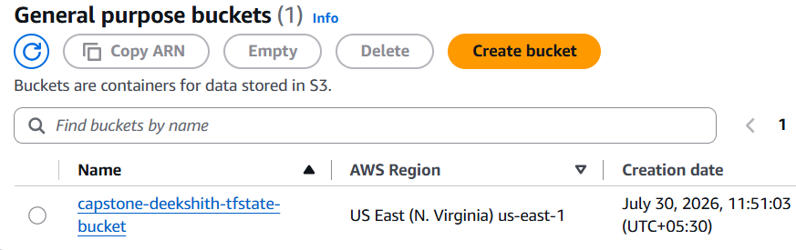</td>
    <td> 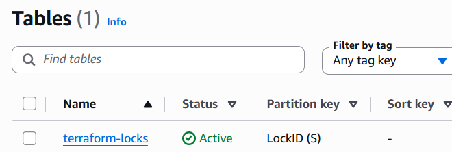</td>
  </tr>
</table>


## Terraform

   All Terraform configurations are located in the [Terraform](/terraform/) directory.

- Terraform provisions the AWS infrastructure, including:
- Virtual Private Cloud (VPC)
- Public and Private Subnets
- Internet Gateway
- NAT Gateway
- Route Tables
- Security Groups
- IAM Roles
- EC2 Instances

### Initialize Terraform

```bash
cd terraform/environments/dev

terraform init
```
### Generate an Execution Plan
  ```bash
terraform plan  -var-file=terraform.tfvars
```
### Apply Infrastructure Changes

  ```bash
terraform apply -var-file=terraform.tfvars
```
<p align=center>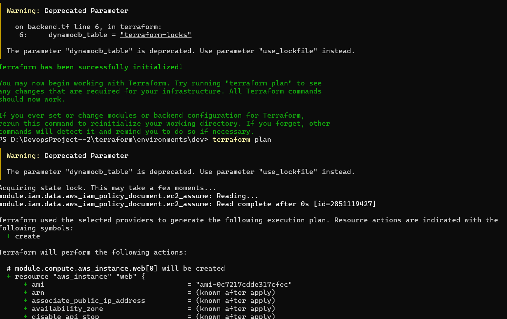</p>
After the deployment completes successfully, Terraform creates all AWS resources defined in the configuration, including networking components, security configurations, IAM resources, and EC2 instances.

### Destroy Infrastructure
When the project is no longer required, remove all resources to avoid unnecessary AWS charges.

```bash
terraform plan -destroy
terraform destroy
```


## Ansible
All Ansible playbooks, inventories, and roles are located in the[Ansible](/ansible) directory.

The project uses the AWS EC2 Dynamic Inventory Plugin, allowing Ansible to automatically discover EC2 instances created by Terraform.

### Verify Dynamic Inventory
   ```bash
 cd ansible
ansible-inventory -i inventory/aws_ec2.yml --graph
 ```
This command displays all EC2 instances discovered dynamically from AWS.


### Execute Playbook

   ```bash
ansible-playbook -i inventory/aws_ec2.yml site.yml
 ```
The playbook performs the following tasks:
- Install Docker
- Install Java
- Install Git
- Configure NGINX
- Configure Jenkins agent prerequisites
- Deploy the Flask Docker container
- Configure system settings
- Start and enable required services

Ansible playbooks are idempotent, meaning they can be executed multiple times without introducing duplicate configurations. Re-running the playbook against an already configured server should report 0 changed for resources that are already in the desired state.

 <p align=center>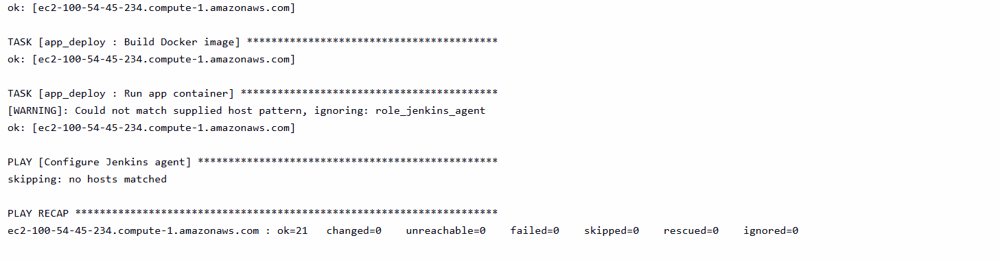</p>


 ## Jenkins CI/CD Pipeline
 The Jenkins pipeline automates the complete infrastructure deployment workflow.

 ### Pipeline stages:

- Checkout
- Terraform Init
- Terraform Plan (output saved to tfplan)
- Manual Approval — pipeline pauses here until a human reviews the plan and clicks Apply
- Terraform Apply (applies the exact plan approved in step 4, not a fresh plan)
- Wait for hosts to be reachable
- Run Ansible Playbooks
- Validate Infrastructure (scripts/validate_infra.sh)

### Required Jenkins Credentials
The following credentials must be configured in Jenkins before executing the pipeline:
- AWS IAM Access Key
- AWS IAM Secret Access Key
- EC2 SSH Private Key
- Git Repository Credentials (if using a private repository)

### Required Jenkins Plugins
Install the following Jenkins plugins:
- Pipeline
- Git
- SSH Agent
- SSH Credentials
- Credentials Binding
- AWS Credentials
- Ansible
- Terraform
- Docker Pipeline

## Infrastructure Validation
After deployment, the pipeline executes the validate_infra.sh script to verify that the infrastructure has been provisioned and configured successfully.

The validation process includes:
- ✅ EC2 Instance Reachability
- ✅ Security Group Validation
- ✅ SSH Connectivity
- ✅ Docker Service Status
- ✅ NGINX Service Status
- ✅ Flask Application Availability
- ✅ HTTP 200 Response Verification
- ✅ Reverse Proxy Validation- 

Successful validation confirms that the infrastructure and application are functioning as expected.

<p align=center>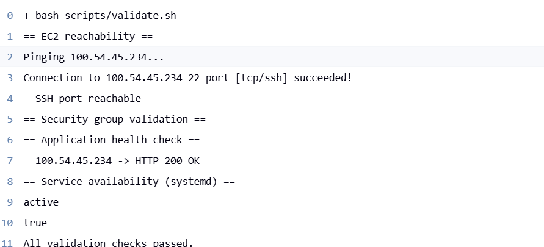</p>

## Deployment Results
The following screenshots demonstrate the successful deployment of the infrastructure and application.
- Terraform Provisioning
- AWS VPC
- Subnets
- Security Groups
- EC2 Instances
- Jenkins Pipeline Execution

<table>
  <tr>
    <td align="center"><b>VPC</b></td>
    <td align="center"><b>Elastic IP</b></td>
  </tr>
  <tr>
    <td align="center">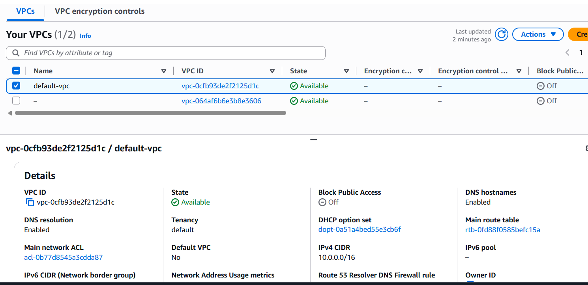</td>
    <td align="center">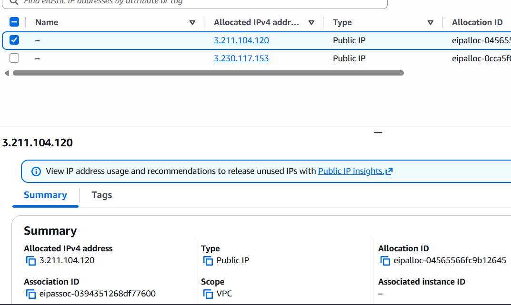</td>
  </tr>
  <tr>
    <td align="center"><b>Public Subnet</b></td>
    <td align="center"><b>Private Subnet</b></td>
  </tr>
  <tr>
    <td align="center">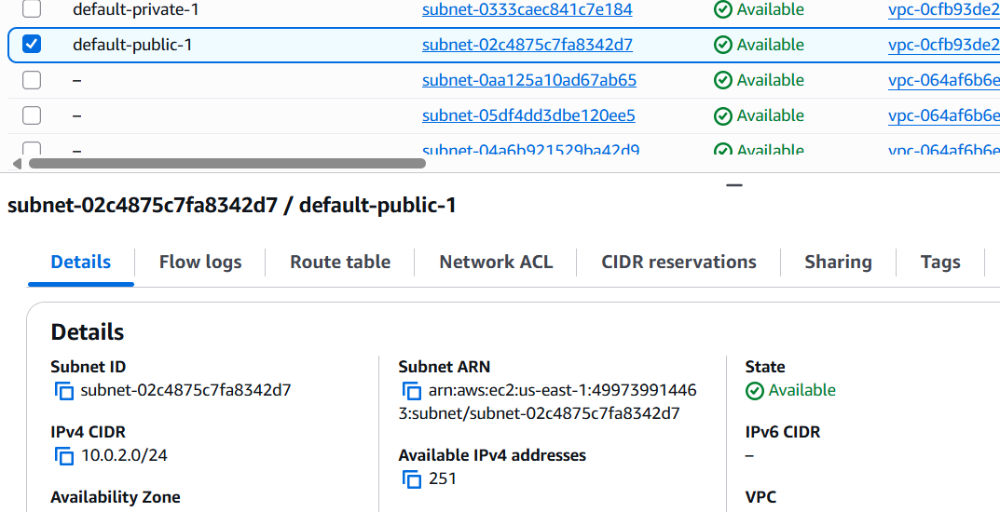</td>
    <td align="center">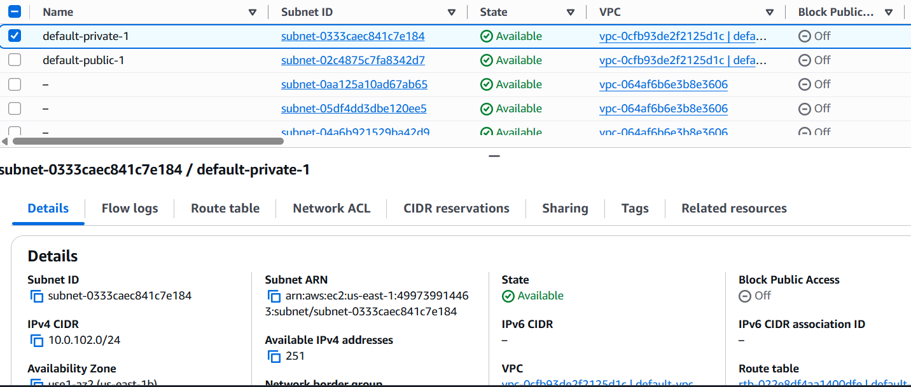</td>
  </tr>
  <tr>
    <td align="center"><b>Public Route Table</b></td>
    <td align="center"><b>Private Route Table</b></td>
  </tr>
  <tr>
    <td align="center">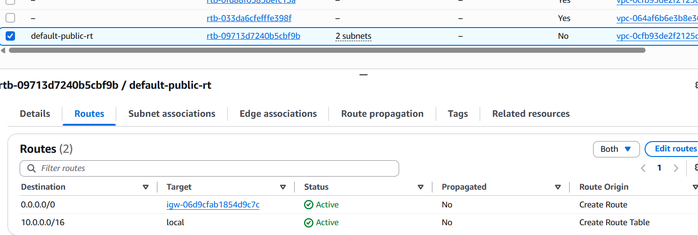</td>
    <td align="center">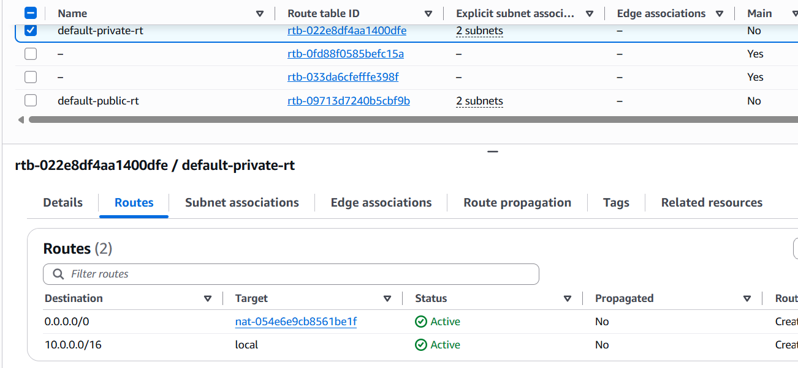</td>
  </tr>
  <tr>
    <td align="center"><b>Nat</b></td>
    <td align="center"><b>Internet Gateway</b></td>
  </tr>
  <tr>
    <td align="center">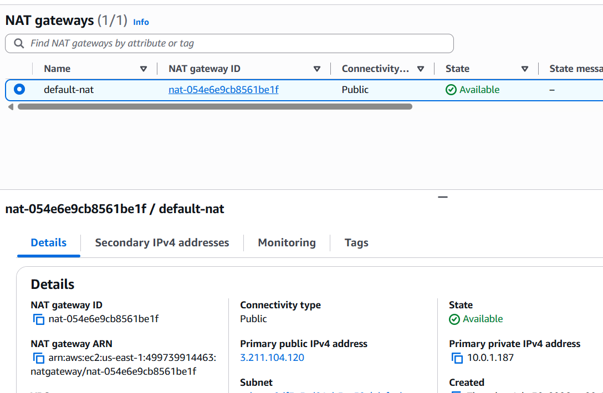</td>
    <td align="center">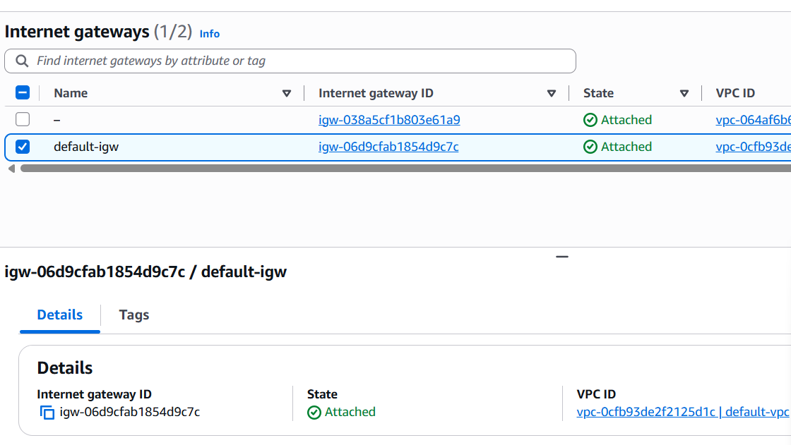</td>
  </tr>
  <tr>
    <td align="center"><b>S3-Bucket</b></td>
    <td align="center"><b>Dynamo</b></td>
  </tr>
  <tr>
    <td align="center">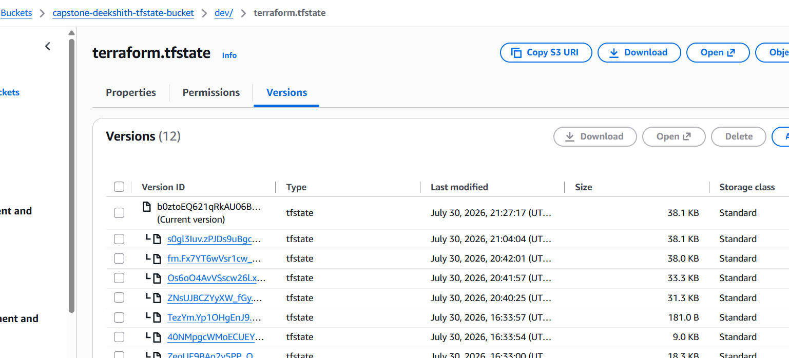</td>
    <td align="center">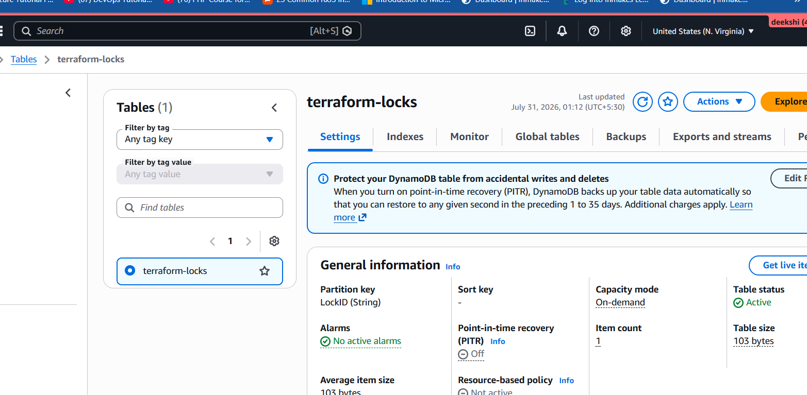</td>
  </tr>
  <tr>
    <td align="center"><b>Instance</b></td>
    <td align="center"><b>Security</b></td>
  </tr>
  <tr>
    <td align="center">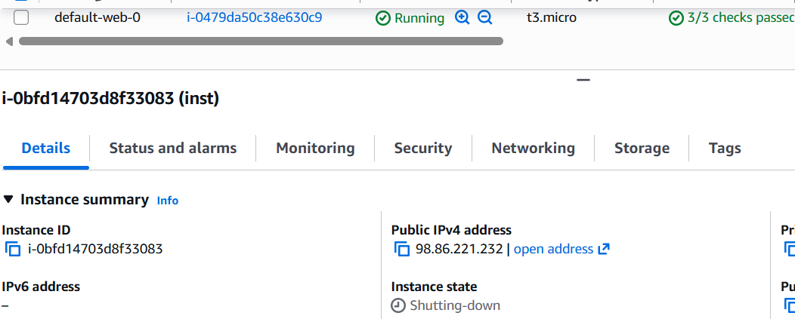</td>
    <td align="center">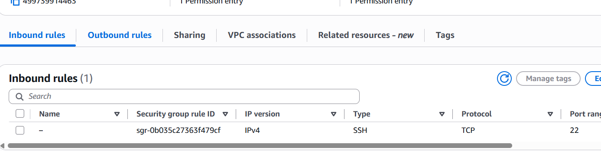</td>
  </tr>
</table>

## Pipeline Image 
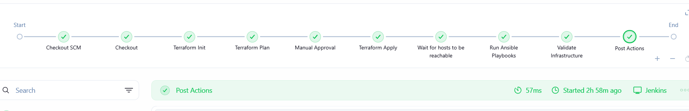

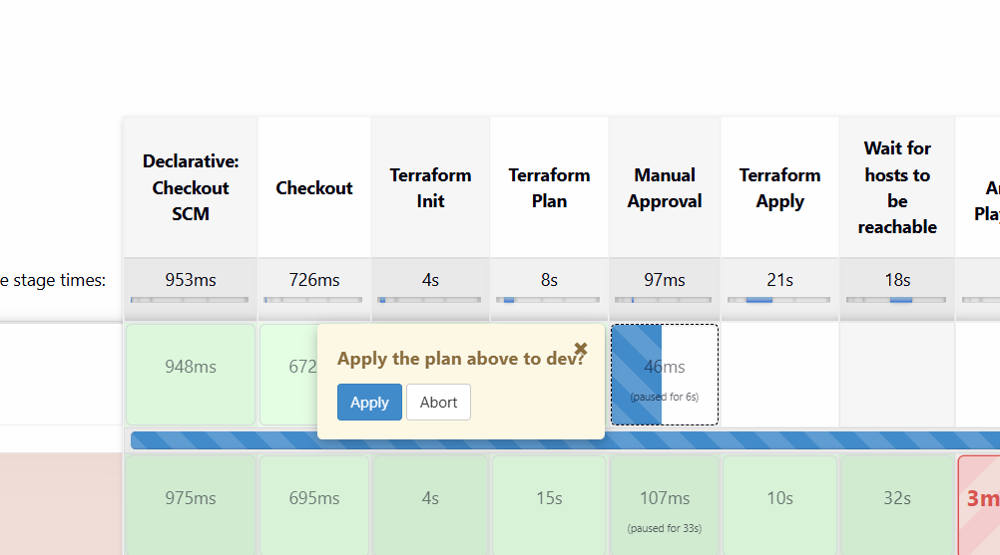
<td align="center"><b>manual trigger</b></td>

## License

This project is intended for educational and demonstration purposes. Feel free to modify and extend it to suit your infrastructure automation requirements.